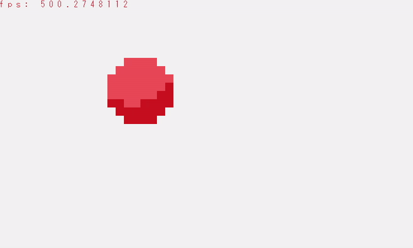

<p align="center">
  
  <h1 align="center">kaliumn</h1>
</p>


A simple single header file library that makes it easier to develop Windows console applications with c.

You can easily change console window properties, play sounds, and display images.

## Compiling

Include kaliumn.h with your project and link *winmm* when compiling.

At the top of your c file:

```c
#include "kaliumn.h"
```

When compiling (MinGW):

```
gcc [file-name].c -o [file-name] -lwinmm
```

## Usage 

*Please refer to the [Wiki](https://github.com/k390983/cmd.h/wiki).* 

## Examples

> ### Play sound
>
> <details><summary>main.c</summary>
>
> ```c
> #include <stdlib.h>
> #include <stdio.h>
> #include "cmd.h"
> int main(void)
> {
>     PlayAudio("sound.mp3", 0);
>     Sleep(1000);
>     PauseAudio("sound.mp3");
>     Sleep(1000);
>     ResumeAudio("sound.mp3");
>     Sleep(1000);
>     StopAudio("sound.mp3");
> }
> 
> ```
> </details>

> ### Bouncing ball
>
> 
>
> <details><summary>main.c</summary>
>
> ```c
> #include <stdlib.h>
> #include <stdio.h>
> #include "../kaliumn.h"
> int main(void)
> {
> 	int x, y;
> 	int WIDTH = 50;
> 	int HEIGHT = 30;
> 	int xDirection = 0;
> 	int yDirection = 0;
> 	char fpsChar[100];
> 	int *player = LoadTexture("texture");
> 	//Initialize Canvas
> 	Startup((WIDTH) * 2, HEIGHT, "test");
> 	InitCanvas(WIDTH, HEIGHT, 71);
> 	x = 0;
> 	y = 0;
> 	while(1)
> 	{
> 		//Collision + Movement
> 		if(x == 0)
> 		{
> 			xDirection = 0;
> 		}
> 		if(x + player[0] == WIDTH)
> 		{
> 			xDirection = 1;
> 		}
> 		if(y == 0)
> 		{
> 			yDirection = 0;
> 		}
> 		if(y + player[1] == HEIGHT)
> 		{
> 			yDirection = 1;
> 		}
> 		if(xDirection == 0)
> 		{
> 			x++;
> 		}
> 		else
> 		{
> 			x--;
> 		}
> 
> 		if(yDirection == 0)
> 		{
> 			y++;
> 		}
> 		else
> 		{
> 			y--;
> 		}
> 		//Clean canvas
> 		CleanCanvas(71);
> 		//Draw ball and fps
> 		DrawTexture(player, x, y);
> 		sprintf(fpsChar, "fps: %f", GetFPS());
> 		DrawChar(fpsChar, 40, 0, 0);
> 		//Display canvas to screen
> 		Display(););
> 	}
> }
> ```
> </details>
>  
> <details><summary>texture</summary>
>
> ```c
> 8, 8
> 99 99 41 41 41 41 99 99 
> 99 41 41 41 41 41 41 99 
> 41 41 41 41 41 41 41 41 
> 41 41 41 41 41 41 41 40 
> 41 41 41 41 41 41 40 40 
> 40 40 41 41 40 40 40 40 
> 99 40 40 40 40 40 40 99 
> 99 99 40 40 40 40 99 99 
> ```
> </details>

## Texture Editor
The Texture Editor can bu used to easily make textures that can be used by Draw().    
*Please refer to the [Wiki](https://github.com/k390983/cmd.h/wiki) for more imformation.* 

## Contributing
Any contributions are **greatly appreciated**.

1. Fork the Project
2. Create your Feature Branch (`git checkout -b feature/cmd.h`)
3. Commit your Changes (`git commit -m 'Add some cmd.h'`)
4. Push to the Branch (`git push origin feature/cmd.h`)
5. Open a Pull Request

----

k390983(https://github.com/k390983) - K2L8M8N1@gmail.com    
Distributed under the MIT license. See `LICENSE` for more information. 
